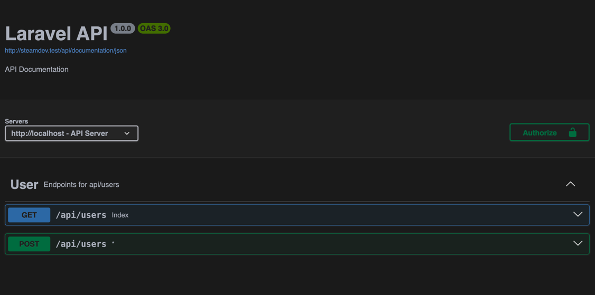

# Auto swagger for Laravel

This package will help you build your Swagger/OpenApi 1.0 Fast and simple



## Installation

```
composer require auto-swagger/php-swagger-generator
```

- Publish config files

```
php artisan vendor:publish --tag=auto-swagger-config
```

- Publish views (optional)

```
php artisan vendor:publish --tag=auto-swagger-views
```

- Publish assets (optional)

```
php artisan vendor:publish --tag=auto-swagger-assets
```

<procedure title="Generate swagger" id="inject-a-procedure">
    <step>
        <p>Run command <code>php artisan swagger:generate</code> for generate openapi.json file</p>
    </step>

</procedure>

## Option for command

Command is support to format json and yaml.

<tabs>
    <tab title="Yaml">
        <code-block lang="plain text">php artisan swagger:generate --format=yaml</code-block>
    </tab>
    <tab title="Json">
               <code-block lang="plain text">php artisan swagger:generate --format=json</code-block>
    </tab>
</tabs>

If run command without any parameters will be generated Json
and you can access in by route [ http:localhost:8000/api/documentation/json ]

## Attributes for generate openapi

```php
#[ApiSwagger(summary: 'Store user', tag: 'User')]
```

ApiSwagger attribute is required for route which is you want to add to documentation

<procedure title="Properties" id="inject-a-procedure_1">
    <step>
        <p><code>summary</code> Description for route</p>
        <p><code>tag</code> Tag for group your routes</p>
    </step>

</procedure>

```php
#[ApiSwaggerRequest(request: UserCreateRequest::class, description: 'Store user')]
```

Attribute for request parameters

```php
  #[ApiSwaggerResponse(status: 200, resource: [
        'id' => 'integer',
        'name' => 'string',
        "email" => "string",
    ])]
```

Attribute for response parameters. Resource can be

<tabs>
    <tab title="Array">
        <code-block lang="plain text">
  #[ApiSwaggerResponse(status: 200, resource: [
        'id' => 'integer',
        'name' => 'string',
        "email" => "string",
    ])]
</code-block>
    </tab>
    <tab title="Resource class">
               <code-block lang="plain text">    
#[ApiSwaggerResponse(status: 200, resource: ApiResource::class, description: 'User details')]
</code-block>
    </tab>
    <tab title="Model class">
               <code-block lang="plain text">    
#[ApiSwaggerResponse(status: 200, resource: Model::class, description: 'User details')]
</code-block>
    </tab>
</tabs>

## Pagination

for Pagination you need extends from PaginatedResource and implement initCollection method

```php
<?php
declare(strict_types=1);

namespace App\Http\Resources\User;

use AutoSwagger\Resources\PaginatedResource;

class UserPaginatedResource extends PaginatedResource
{
    public function initCollection()
    {
        return $this->collection->map(function ($user) {
            return new UserResource($user);
        });
    }
}

```
and on ```ApiSwaggerResponse``` attribute make isPagination true

```php
    #[ApiSwagger(summary: 'Get all users', tag: 'User')]
    #[ApiSwaggerResponse(status: 200, resource: UserResource::class, isPagination: true)]
    public function index(Request $request): UserPaginatedResource
    {
        $users = $this->userRepository->paginate($request->input('perPage', 10));

        return new UserPaginatedResource($users);
    }
```

## Feedback and support

You can also always email me at [letenantdoniyor@gmail.com](mailto:letenantdoniyor@gmail.com).